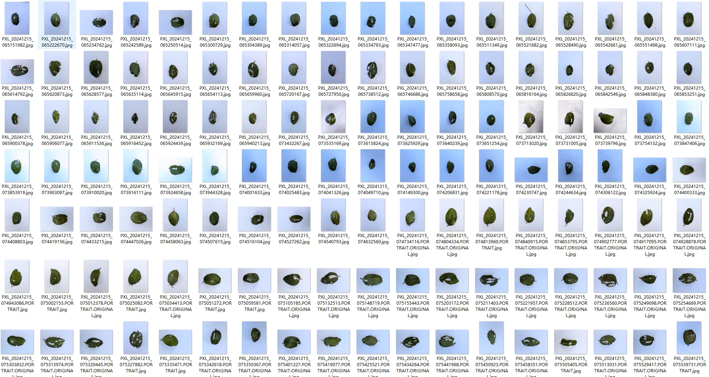
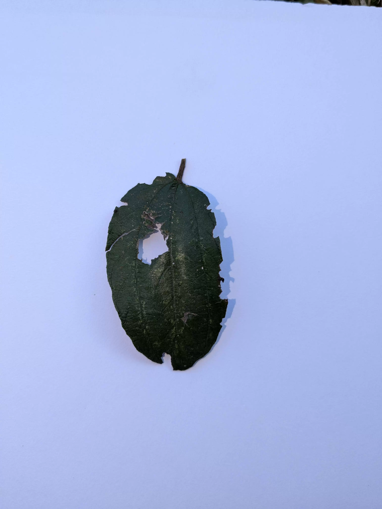
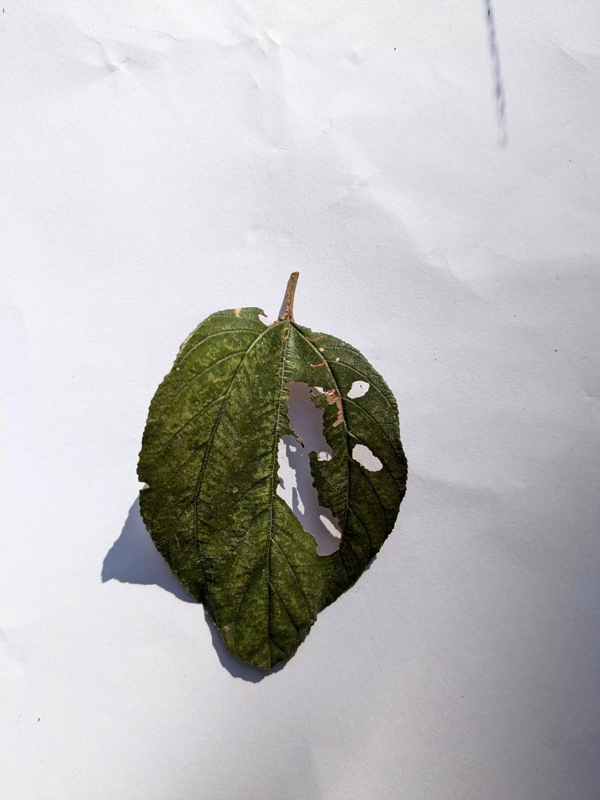
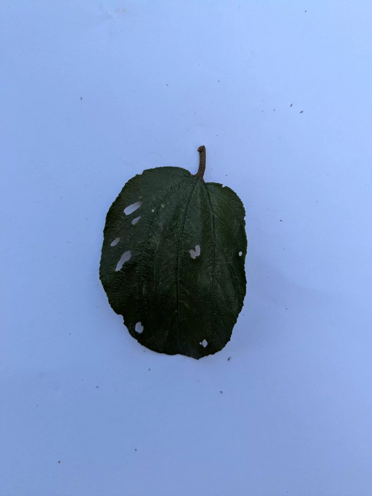

## Body

（Agricultural Products）Zha Ye Disease Classification Image Dataset High-Definition Images

Number of images: Original images: 485, Data Augmentation: 2373, Total 2858 original and data augmented images stored separately.

Data categories
English original Chinese translation name Original image count (张) Augmented image count (张)
Chafer Beetle Insect Pest 247 715
Healthy Leaves Healthy Leaf 63 665
Leaf End Rot Lesion 80 320
Mealybug Insect Pest 7 353
Nutritional Deficiency Nutritional Deficiency 88 320
Electronic virtual products are not returnable after sale.

## Images

item_1058007357788

Here is a pay link on Stripe ( https://buy.stripe.com/3cs8yP7sY87d0vu9AB ). Please contact me lonlonago@foxmail.com after funding $89, and I will send you a complete data files , thank you!

